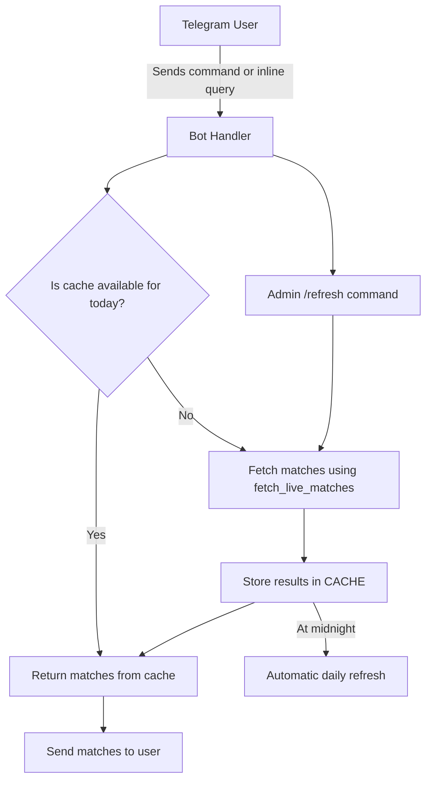

# Strikeout Live Bot

A Telegram bot that fetches live sports matches from Strikeout and provides them via inline search or commands.

## Features

- Fetches live matches for multiple sports (soccer, basketball, etc.)
- Inline search: type `@YourBotName <league>` in any chat
- Per-league commands: `/premierleague`, `/laliga`, `/nba`, etc.
- Catch-all command: `/matches <league name>` with fuzzy search
- Daily caching to avoid repeated scraping
- Admin-only `/refresh` command to manually refresh the cache
- Automatic daily cache refresh at midnight (optional notification to admin)
- Lightweight and fast

## Installation

1. Clone the repository:

```bash
git clone https://github.com/MrSakine/strikeout-scraper.git
````

2. Navigate into the project directory:

```bash
cd strikeout-scraper
```

3. Install dependencies:

```bash
pip install -r requirements.txt
```

## Configuration

The bot uses a `config.json` file to store credentials and settings. Create a file called `config.json` in the project root:

```json
{
  "api_id": 123456,
  "api_hash": "your_api_hash",
  "bot_token": "your_bot_token",
  "admin_id": 123456789
}
```

* `api_id` and `api_hash` → obtained from [Telegram API](https://my.telegram.org/apps)
* `bot_token` → obtained from [BotFather](https://t.me/BotFather)
* `admin_id` → your Telegram user ID (for admin-only commands and notifications)

## Usage

1. Run the bot:

```bash
python bot.py
```

2. Use it on Telegram:

   * Inline search: `@YourBotName premier league`
   * League commands: `/premierleague`, `/laliga`, `/nba`, etc.
   * Catch-all: `/matches <league name>`
   * Admin refresh: `/refresh` (resets cached matches)
   * `/help` → shows usage instructions and list of commands

3. The bot caches matches **per day**, so repeated requests are fast.

## Bot Flow Diagram



### How it works:

* Users send a **command** (`/matches`) or **inline query**.
* The bot first checks if today's matches are in the **cache**.
* If yes → returns cached results immediately.
* If no → calls `fetch_live_matches()`, stores the results in cache, then responds.
* Admins can force refresh with `/refresh`.
* The cache also **auto-refreshes at midnight**.

## Proxy

https://github.com/proxifly/free-proxy-list

## License

This project is licensed under the Apache-2.0 License.

This version includes:  
- Features, installation, and usage  
- `config.json` setup  
- Inline search & commands  
- Daily caching & admin refresh  
- A Mermaid flowchart to visualize the bot logic  
